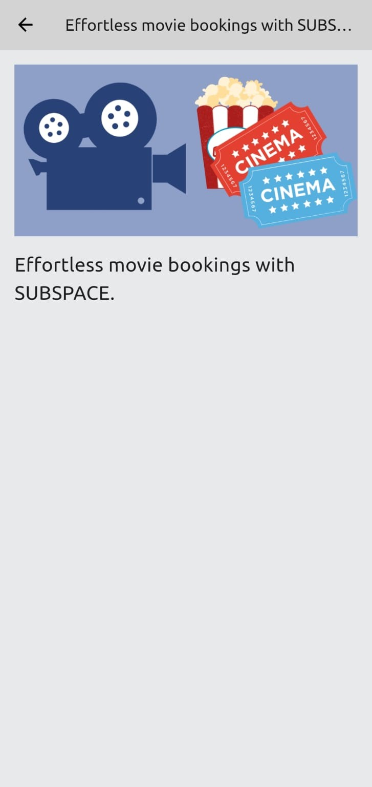

# 📱 ub_space

**ub_space** is a sleek and responsive mobile blog application built using **Flutter**. It allows users to explore, read, and favorite blogs for quick access, offering a smooth and engaging reading experience.


## ✨ Features

- 📖 **Explore Blogs** – Browse a collection of blogs fetched dynamically from an external API.
- 🌐 **Read Full Articles** – Dive into complete blog content with a clean and readable interface.
- ⭐ **Favorite Blogs** – Save your favorite reads for quick and easy access later.
- 🚀 **Smooth UI/UX** – Enjoy a responsive and modern Flutter UI optimized for performance.

## 🛠 Tech Stack

- **Flutter** – Frontend framework
- **Dart** – Programming language
- **External REST API** – For fetching blog data

---

## 📸 Screenshots

<div style="display: flex; gap: 16px; flex-wrap: wrap; justify-content: start;">
  
  
</div>

---

## 🚀 Getting Started

To run this project locally:

1. **Clone the repo**
   ```bash
   git clone https://github.com/Vedant405/ub_space.git
   cd ub_space
   ```

2. **Install dependencies**
   ```bash
   flutter pub get
   ```

3. **Run the app**
   ```bash
   flutter run
   ```

---

## 📂 Folder Structure

  ```bash
    ub_space/
  ├── lib/
  │   ├── screens/
  │   ├── widgets/
  │   ├── models/
  │   ├── services/
  │   └── main.dart
  ├── assets/
  ├── pubspec.yaml
  └── README.md
  ```

---

## 🔗 API Integration
ub_space fetches blog data using a RESTful API. The app handles parsing and presenting the data in a user-friendly format.

> Developed with ❤️ by [Vedant405](https://github.com/Vedant405)
